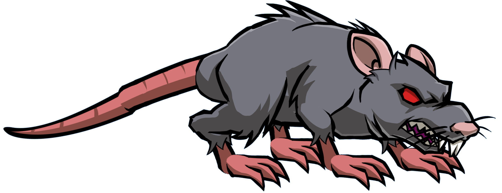

# ratpy
#### another snake friendly rat

## Architecture
### Master branch - includes tools
#### --------
### Master
* interface - server menu
* threadpool - running paralel code to serve menu while waiting and handling connections set to up to 20 by default
* tools - backdoor :: encrypted reverse shell 30s RAT connection with respawn and client-side
* utils - command line interface, encryption methods and connection methods
> python3 __main__.py <server_ip_addr> <rat_port> <shell_port>
### _________________________________________________________________________

### Slave
* tools - RAT client; linux C keylogger with daemonisation (must be rooted)
* utils - command line interface, encryption methods and connection methods
* obfuscator - obfuscator for client side RAT deployement
> python3 __main__.py <server_ip_addr> <rat_port>
### _________________________________________________________________________

## Development
* [x] add cat and ls with path arg
* [x] split into classes both master and client
* [x] encrypt communication
* [x] threading pool stable for one connection
* [x] linux keylogger extension
* [x] multithread to accept multiple connections and hold 
* [x] encrypt shell connection
* [x] rebirth slave every t seconds and recconect to master 
* [ ] obfuscate backdoor interpreter and keylogger 
* [ ] sniffer extension
* [ ] rookit extension
